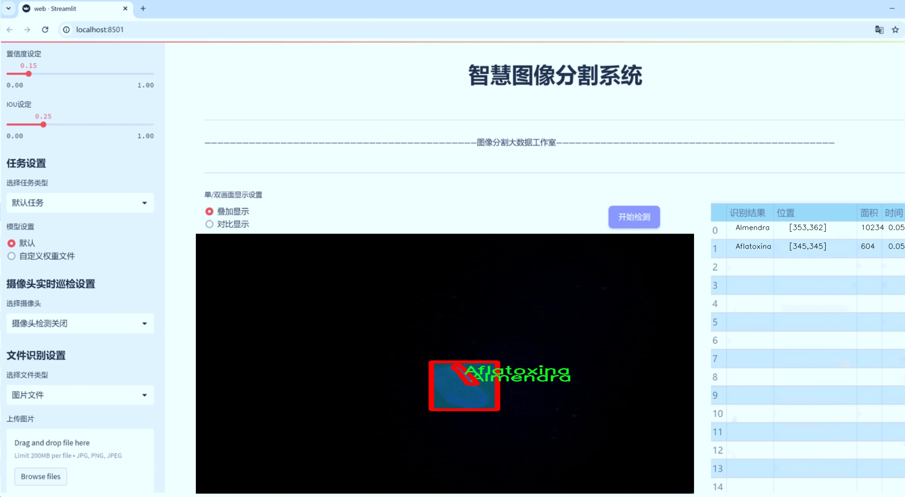
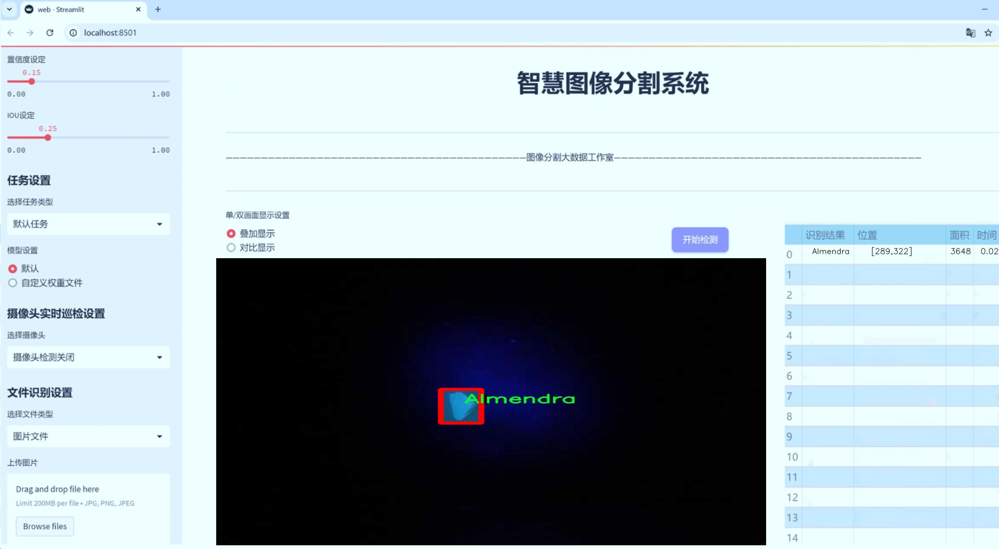
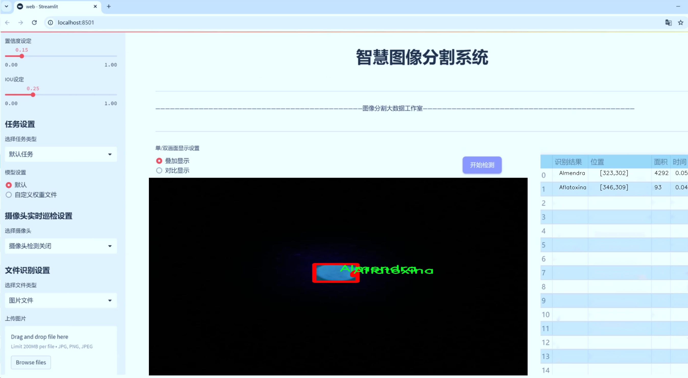
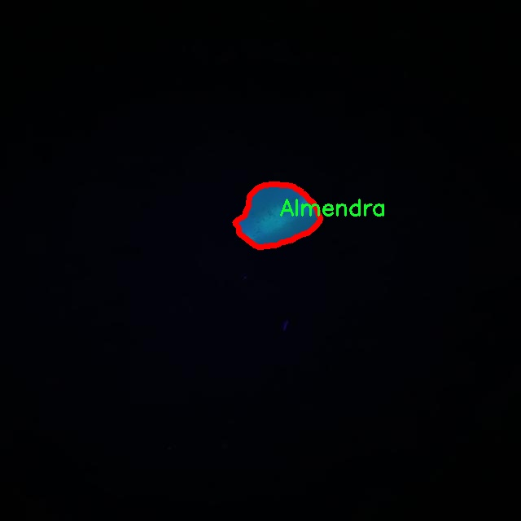
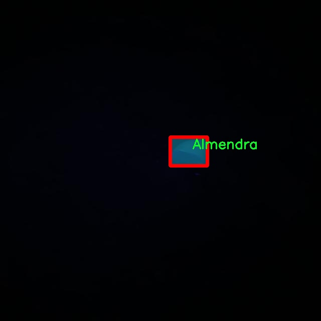
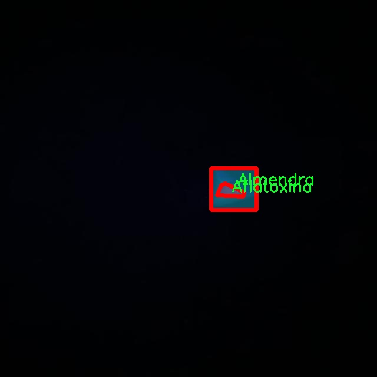
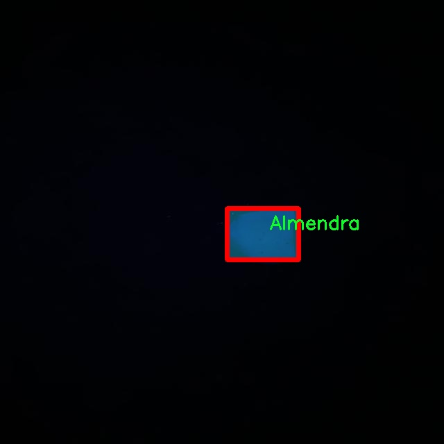

# 黄曲霉毒素检测分割系统源码＆数据集分享
 [yolov8-seg-LSKNet＆yolov8-seg-C2f-DLKA等50+全套改进创新点发刊_一键训练教程_Web前端展示]

### 1.研究背景与意义

项目参考[ILSVRC ImageNet Large Scale Visual Recognition Challenge](https://gitee.com/YOLOv8_YOLOv11_Segmentation_Studio/projects)

项目来源[AAAI Global Al lnnovation Contest](https://kdocs.cn/l/cszuIiCKVNis)

研究背景与意义

黄曲霉毒素（Aflatoxin）是一种由某些真菌（如黄曲霉和寄生曲霉）产生的强致癌物，广泛存在于农作物中，尤其是坚果、谷物和香料等食品中。其毒性不仅对人类健康构成严重威胁，还对动物的生长和发育产生负面影响。根据世界卫生组织（WHO）的报告，黄曲霉毒素的摄入与肝癌等多种疾病的发生密切相关，因此对其进行有效检测与控制显得尤为重要。传统的黄曲霉毒素检测方法主要依赖于化学分析和生物检测，虽然这些方法在准确性上有一定优势，但往往耗时长、成本高，且难以实现大规模的实时监测。

随着计算机视觉和深度学习技术的迅猛发展，基于图像处理的自动化检测方法逐渐成为研究热点。YOLO（You Only Look Once）系列模型因其高效的实时目标检测能力而被广泛应用于各类视觉任务中。YOLOv8作为该系列的最新版本，具备更高的检测精度和更快的处理速度，能够在复杂环境中实现精准的目标识别和分割。因此，基于改进YOLOv8的黄曲霉毒素检测分割系统的研究，不仅具有重要的学术价值，也为实际应用提供了新的解决方案。

本研究将利用包含1200张图像的数据集，针对黄曲霉毒素的检测与分割进行深入探讨。该数据集涵盖了两类目标：黄曲霉毒素（Aflatoxina）和坚果（Almendra），为模型的训练和验证提供了丰富的样本。通过对这些图像进行实例分割，研究旨在实现对黄曲霉毒素的精准定位与识别，从而为后续的风险评估和食品安全监测提供科学依据。相较于传统方法，基于深度学习的检测系统能够实现更高的自动化程度和更快的响应速度，适应现代食品工业对实时监测的需求。

此外，研究的意义还体现在其对食品安全领域的贡献。随着全球贸易的不断扩大，食品安全问题日益凸显，尤其是在发展中国家，黄曲霉毒素的污染问题亟待解决。通过建立高效的检测系统，可以帮助相关部门及时发现和处理污染食品，降低食品安全风险，保护消费者的健康。同时，该研究还为其他类型的有害物质检测提供了参考，推动了计算机视觉技术在食品安全领域的应用。

综上所述，基于改进YOLOv8的黄曲霉毒素检测分割系统的研究，不仅具有重要的理论意义，也为实际应用提供了创新的解决方案，推动了食品安全监测技术的发展，具有广泛的社会价值和应用前景。

### 2.图片演示







##### 注意：由于此博客编辑较早，上面“2.图片演示”和“3.视频演示”展示的系统图片或者视频可能为老版本，新版本在老版本的基础上升级如下：（实际效果以升级的新版本为准）

  （1）适配了YOLOV8的“目标检测”模型和“实例分割”模型，通过加载相应的权重（.pt）文件即可自适应加载模型。

  （2）支持“图片识别”、“视频识别”、“摄像头实时识别”三种识别模式。

  （3）支持“图片识别”、“视频识别”、“摄像头实时识别”三种识别结果保存导出，解决手动导出（容易卡顿出现爆内存）存在的问题，识别完自动保存结果并导出到tempDir中。

  （4）支持Web前端系统中的标题、背景图等自定义修改，后面提供修改教程。

  另外本项目提供训练的数据集和训练教程,暂不提供权重文件（best.pt）,需要您按照教程进行训练后实现图片演示和Web前端界面演示的效果。

### 3.视频演示

[3.1 视频演示](https://www.bilibili.com/video/BV1oZDnYHEHV/)

### 4.数据集信息展示

##### 4.1 本项目数据集详细数据（类别数＆类别名）

nc: 2
names: ['Aflatoxina', 'Almendra']


##### 4.2 本项目数据集信息介绍

数据集信息展示

在本研究中，我们采用了名为“aflatoxin detection”的数据集，以支持改进YOLOv8-seg模型在黄曲霉毒素检测与分割任务中的应用。该数据集专门设计用于识别和分割与黄曲霉毒素相关的图像，具有重要的实用价值和研究意义。数据集包含两大类，分别为“Aflatoxina”（黄曲霉毒素）和“Almendra”（杏仁），这两类的选择不仅反映了黄曲霉毒素的来源，还涵盖了其对食品安全的影响。

在数据集的构建过程中，研究团队精心挑选了多种样本，以确保数据的多样性和代表性。每一类样本均经过严格筛选，确保其质量和准确性，从而为模型的训练提供坚实的基础。数据集中包含的图像涵盖了不同的拍摄角度、光照条件和背景环境，旨在模拟实际应用场景中可能遇到的各种情况。这种多样性使得模型在面对真实世界中的复杂情况时，能够具备更强的适应性和鲁棒性。

数据集的标注工作同样至关重要。每张图像都经过专业标注人员的仔细处理，确保每个目标的边界框和分割区域的准确性。标注过程中，采用了先进的图像处理技术，结合人工审核，确保数据集的高质量。这一过程不仅提高了数据集的可信度，也为后续的模型训练提供了可靠的监督信号。

在模型训练阶段，数据集的类别数量为2，这使得模型能够专注于学习这两类之间的特征差异。通过对“Aflatoxina”和“Almendra”这两类的深入学习，YOLOv8-seg模型能够有效地识别和分割出图像中的黄曲霉毒素及其潜在的宿主。这一过程不仅有助于提高检测的准确性，也为食品安全监测提供了强有力的技术支持。

此外，数据集的使用还涉及到多种数据增强技术，以进一步提升模型的泛化能力。通过旋转、缩放、翻转等操作，研究团队能够在有限的样本基础上，生成更多的训练样本，从而丰富模型的学习经验。这种数据增强策略不仅能够有效防止模型的过拟合现象，还能提高其在实际应用中的表现。

综上所述，“aflatoxin detection”数据集为改进YOLOv8-seg的黄曲霉毒素检测分割系统提供了重要的支持。通过精心设计和高质量的标注，该数据集不仅增强了模型的学习能力，也为未来的研究提供了宝贵的参考。随着食品安全问题日益受到重视，基于该数据集的研究成果将为提升食品检测技术水平、保障公众健康做出积极贡献。










### 5.全套项目环境部署视频教程（零基础手把手教学）

[5.1 环境部署教程链接（零基础手把手教学）](https://www.bilibili.com/video/BV1jG4Ve4E9t/?vd_source=bc9aec86d164b67a7004b996143742dc)


[5.2 安装Python虚拟环境创建和依赖库安装视频教程链接（零基础手把手教学）](https://www.bilibili.com/video/BV1nA4VeYEze/?vd_source=bc9aec86d164b67a7004b996143742dc)

### 6.手把手YOLOV8-seg训练视频教程（零基础小白有手就能学会）

[6.1 手把手YOLOV8-seg训练视频教程（零基础小白有手就能学会）](https://www.bilibili.com/video/BV1cA4VeYETe/?vd_source=bc9aec86d164b67a7004b996143742dc)


按照上面的训练视频教程链接加载项目提供的数据集，运行train.py即可开始训练



     Epoch   gpu_mem       box       obj       cls    labels  img_size
     1/200     0G   0.01576   0.01955  0.007536        22      1280: 100%|██████████| 849/849 [14:42<00:00,  1.04s/it]
               Class     Images     Labels          P          R     mAP@.5 mAP@.5:.95: 100%|██████████| 213/213 [01:14<00:00,  2.87it/s]
                 all       3395      17314      0.994      0.957      0.0957      0.0843

     Epoch   gpu_mem       box       obj       cls    labels  img_size
     2/200     0G   0.01578   0.01923  0.007006        22      1280: 100%|██████████| 849/849 [14:44<00:00,  1.04s/it]
               Class     Images     Labels          P          R     mAP@.5 mAP@.5:.95: 100%|██████████| 213/213 [01:12<00:00,  2.95it/s]
                 all       3395      17314      0.996      0.956      0.0957      0.0845

     Epoch   gpu_mem       box       obj       cls    labels  img_size
     3/200     0G   0.01561    0.0191  0.006895        27      1280: 100%|██████████| 849/849 [10:56<00:00,  1.29it/s]
               Class     Images     Labels          P          R     mAP@.5 mAP@.5:.95: 100%|███████   | 187/213 [00:52<00:00,  4.04it/s]
                 all       3395      17314      0.996      0.957      0.0957      0.0845


### 7.50+种全套YOLOV8-seg创新点代码加载调参视频教程（一键加载写好的改进模型的配置文件）

[7.1 50+种全套YOLOV8-seg创新点代码加载调参视频教程（一键加载写好的改进模型的配置文件）](https://www.bilibili.com/video/BV1Hw4VePEXv/?vd_source=bc9aec86d164b67a7004b996143742dc)

### 8.YOLOV8-seg图像分割算法原理

原始YOLOV8-seg算法原理

YOLOv8-seg算法作为YOLO系列的最新发展，延续了其前身YOLOv5和YOLOv7的优良传统，并在此基础上进行了多项创新和改进。该算法的核心框架依然由输入层、主干网络、特征融合层和解耦头组成，然而其设计理念和实现方式则展示了更高的灵活性和性能优化。YOLOv8-seg不仅在目标检测方面表现出色，同时也在图像分割任务中展现了强大的能力。

在YOLOv8-seg的主干网络部分，算法采用了CSPDarknet的结构理念，这一设计灵感源自于YOLOv5，但进行了进一步的优化。YOLOv8将YOLOv5中的C3模块替换为C2f模块，这一改动不仅使得网络在保持高检测精度的同时实现了轻量化，更为重要的是，C2f模块的引入使得特征提取过程中的梯度流动得到了有效改善。C2f模块由多个CBS（卷积+归一化+SiLU激活）模块和Bottleneck网络构成，通过引入ELAN思想，C2f模块能够在不同分支间实现高效的信息传递与融合，从而增强了特征的重用能力，解决了深层网络中常见的梯度消失问题。

特征融合层采用了PAN-FPN结构，这一结构的设计目的是为了实现多尺度特征的深度融合。在YOLOv8中，特征融合过程分为自下而上的高层特征与中层、浅层特征的融合，以及自上而下的特征传递。通过这一方式，YOLOv8能够有效地结合不同层次的特征信息，提升目标检测的精度和鲁棒性。此外，YOLOv8在特征融合过程中还优化了上采样阶段，去除了不必要的卷积操作，使得特征融合更加高效。

YOLOv8-seg的一个显著特点是其采用了Anchor-Free的设计理念，摒弃了传统的Anchor-Base方法。这一转变使得模型在处理不同尺度和形状的目标时更加灵活，同时减少了超参数的调节难度。YOLOv8-seg的样本匹配策略也由静态匹配转变为Task-Aligned的Assigner匹配方式，这一改进使得模型在训练过程中能够更好地适应不同的任务需求，提升了模型的适应性和泛化能力。

在损失函数的设计上，YOLOv8-seg引入了VFLLoss作为分类损失，并结合DFLLoss和CIoULoss进行边框回归。这一组合损失函数的设计不仅提高了模型的分类精度，还有效地解决了样本不平衡问题，尤其是在处理小目标时，模型的表现得到了显著提升。

YOLOv8-seg在数据预处理方面也借鉴了YOLOv5的策略，采用了包括马赛克增强、混合增强、空间扰动和颜色扰动等多种数据增强手段。这些增强手段的引入，不仅丰富了训练数据的多样性，还有效提升了模型的鲁棒性和泛化能力。

在Head部分，YOLOv8-seg采用了解耦头的设计理念，取消了传统的objectness分支，直接通过边框回归和目标分类进行解耦处理。这一设计使得模型在进行目标检测时能够更加高效地处理不同尺度的特征图，最终输出多个尺度的检测结果。

值得一提的是，YOLOv8-seg的整体架构设计旨在实现高效的目标检测与图像分割任务。通过对网络结构的不断优化和创新，YOLOv8-seg在处理复杂场景和多目标检测时，展现出了卓越的性能。其在目标检测和图像分割任务中的应用潜力，使得YOLOv8-seg成为了计算机视觉领域的重要工具之一。

总的来说，YOLOv8-seg算法通过对YOLO系列的不断演进与创新，结合了先进的网络结构设计和高效的特征融合策略，展现了出色的目标检测与图像分割能力。其在实际应用中的表现也证明了这一算法在计算机视觉领域的广泛适用性和强大潜力。随着YOLOv8-seg的不断发展和完善，未来的计算机视觉任务将能够借助这一算法实现更高的效率和精度。


### 9.系统功能展示（检测对象为举例，实际内容以本项目数据集为准）

图9.1.系统支持检测结果表格显示

  图9.2.系统支持置信度和IOU阈值手动调节

  图9.3.系统支持自定义加载权重文件best.pt(需要你通过步骤5中训练获得)

  图9.4.系统支持摄像头实时识别

  图9.5.系统支持图片识别

  图9.6.系统支持视频识别

  图9.7.系统支持识别结果文件自动保存

  图9.8.系统支持Excel导出检测结果数据


### 10.50+种全套YOLOV8-seg创新点原理讲解（非科班也可以轻松写刊发刊，V11版本正在科研待更新）

#### 10.1 由于篇幅限制，每个创新点的具体原理讲解就不一一展开，具体见下列网址中的创新点对应子项目的技术原理博客网址【Blog】：


[10.1 50+种全套YOLOV8-seg创新点原理讲解链接](https://gitee.com/qunmasj/good)

#### 10.2 部分改进模块原理讲解(完整的改进原理见上图和技术博客链接)【如果此小节的图加载失败可以通过CSDN或者Github搜索该博客的标题访问原始博客，原始博客图片显示正常】

### YOLOv8模型
YOLOv8模型由Ultralytics团队在YOLOv5模型的基础上，吸收了近两年半来经过实际验证的各种改进，于2023年1月提出。与之前的一些YOLO 系列模型想类似，YOLOv8模型也有多种尺寸，下面以YOLOv8n为例，分析 YOLOv8模型的结构和改进点。YOLOv8模型网络结构如
输入图片的部分，由于发现Mosaic数据增强尽管这有助于提升模型的鲁棒性和泛化性，但是，在一定程度上，也会破坏数据的真实分布，使得模型学习到一些不好的信息。所以YOLOv8模型在训练中的最后10个epoch 停止使用Mosaic数据增强。


在网络结构上，首先主干网络的改变不大，主要是将C3模块替换为了C2f模块，该模块的结构在上图中已示出。C2f模块在C3模块的思路基础上，引入了YOLOv7中 ELAN的思路，引入了更多的跳层连接，这有助于该模块获得更丰富的梯度流信息，而且模型的轻量化得到了保证。依然保留了SPPF，效果不变的同时减少了该模块的执行时间。
在颈部网络中，也是将所有的C3模块更改为C2f模块，同时删除了两处上采样之前的卷积连接层。
在头部网络中，采用了YOLOX中使用的解耦头的思路，两条并行的分支分别提取类别和位置特征。由于分类任务更注重于分析特征图中提取到的特征与已输入图片的部分，由于发现 Mosaic数据增强尽管这有助于提升模型的鲁棒性和泛化性，但是，在一定程度上，也会破坏数据的真实分布，使得模型学习到一些不好的信息。所以YOLOv8模型在训练中的最后10个epoch停止使用Mosaic数据增强。
在网络结构上，首先主干网络的改变不大，主要是将C3模块替换为了C2f模块，该模块的结构在上图中已示出。C2f模块在C3模块的思路基础上，引入了YOLOv7中ELAN的思路，引入了更多的跳层连接，这有助于该模块获得更丰富的梯度流信息，而且模型的轻量化得到了保证。依然保留了SPPF，效果不变的同时减少了该模块的执行时间。
在颈部网络中，也是将所有的C3模块更改为C2f模块，同时删除了两处上采样之前的卷积连接层。
在头部网络中，采用了YOLOX中使用的解耦头的思路，两条并行的分支分别提取类别和位置特征。由于分类任务更注重于分析特征图中提取到的特征与已有类别中的哪一种更为相似，而定位任务更关注边界框与真值框的位置关系，并据此对边界框的坐标进行调整。侧重点的不同使得在使用两个检测头时收敛的速度和预测的精度有所提高。而且使用了无锚框结构，直接预测目标的中心，并使用TAL (Task Alignment Learning，任务对齐学习）来区分正负样本，引入了分类分数和IOU的高次幂乘积作为衡量任务对齐程度的指标，认为同时拥有好的定位和分类评价的在分类和定位损失函数中也引入了这项指标。
在模型的检测结果上，YOLOv8模型也取得了较好的成果，图为官方在coCO数据集上 YOLOv8模型的模型尺寸大小和检测的mAP50-95对比图。mAP50-95指的是IOU的值从50%取到95%，步长为5%，然后算在这些IOU下的mAP的均值。图的 a）图展示了YOLOv8在同尺寸下模型中参数没有较大增加的前提下取得了比其他模型更好的精度，图2-17的b)图展示了YOLOv8比其他YOLO系列模型在同尺寸时，推理速度更快且精度没有太大下降。


### 视觉transformer(ViT)简介
视觉transformer(ViT)最近在各种计算机视觉任务中证明了巨大的成功，并受到了相当多的关注。与卷积神经网络(CNNs)相比，ViT具有更强的全局信息捕获能力和远程交互能力，表现出优于CNNs的准确性，特别是在扩大训练数据大小和模型大小时[An image is worth 16x16 words: Transformers for image recognition at scale,Coatnet]。

尽管ViT在低分辨率和高计算领域取得了巨大成功，但在高分辨率和低计算场景下，ViT仍不如cnn。例如，下图(左)比较了COCO数据集上当前基于cnn和基于vit的一级检测器。基于vit的检测器(160G mac)和基于cnn的检测器(6G mac)之间的效率差距超过一个数量级。这阻碍了在边缘设备的实时高分辨率视觉应用程序上部署ViT。


左图:现有的基于vit的一级检测器在实时目标检测方面仍然不如当前基于cnn的一级检测器，需要的计算量多出一个数量级。本文引入了第一个基于vit的实时对象检测器来弥补这一差距。在COCO上，efficientvit的AP比efficientdet高3.8，而mac较低。与YoloX相比，efficient ViT节省67.2%的计算成本，同时提供更高的AP。

中:随着输入分辨率的增加，计算成本呈二次增长，无法有效处理高分辨率的视觉应用。

右图:高分辨率对图像分割很重要。当输入分辨率从1024x2048降低到512x1024时，MobileNetV2的mIoU减少12% (8.5 mIoU)。在不提高分辨率的情况下，只提高模型尺寸是无法缩小性能差距的。

ViT的根本计算瓶颈是softmax注意模块，其计算成本随输入分辨率的增加呈二次增长。例如，如上图(中)所示，随着输入分辨率的增加，vit- small[Pytorch image models. https://github.com/rwightman/ pytorch-image-models]的计算成本迅速显著大于ResNet-152的计算成本。

解决这个问题的一个直接方法是降低输入分辨率。然而，高分辨率的视觉识别在许多现实世界的计算机视觉应用中是必不可少的，如自动驾驶，医疗图像处理等。当输入分辨率降低时，图像中的小物体和精细细节会消失，导致目标检测和语义分割性能显著下降。

上图(右)显示了在cityscape数据集上不同输入分辨率和宽度乘法器下MobileNetV2的性能。例如，将输入分辨率从1024x2048降低到512x1024会使cityscape的性能降低12% (8.5 mIoU)。即使是3.6倍高的mac，只放大模型尺寸而不增加分辨率也无法弥补这一性能损失。

除了降低分辨率外，另一种代表性的方法是限制softmax注意，方法是将其范围限制在固定大小的局部窗口内[Swin transformer,Swin transformer v2]或降低键/值张量的维数[Pyramid vision transformer,Segformer]。然而，它损害了ViT的非局部注意能力，降低了全局接受域(ViT最重要的优点)，使得ViT与大内核cnn的区别更小[A convnet for the 2020s,Scaling up your kernels to 31x31: Revisiting large kernel design in cnns,Lite pose: Efficient architecture design for 2d human pose estimation]。

本文介绍了一个有效的ViT体系结构，以解决这些挑战。发现没有必要坚持softmax注意力。本文建议用线性注意[Transformers are rnns: Fast autoregressive transformers with linear attention]代替softmax注意。

线性注意的关键好处是，它保持了完整的n 2 n^2n 2
 注意映射，就像softmax注意。同时，它利用矩阵乘法的联想特性，避免显式计算完整的注意映射，同时保持相同的功能。因此，它保持了softmax注意力的全局特征提取能力，且计算复杂度仅为线性。线性注意的另一个关键优点是它避免了softmax，这使得它在移动设备上更有效(下图左)。


左图:线性注意比类似mac下的softmax注意快3.3-4.5倍，这是因为去掉了硬件效率不高的softmax功能。延迟是在Qualcomm Snapdragon 855 CPU和TensorFlow-Lite上测量的。本文增加线性注意的头部数量，以确保它具有与softmax注意相似的mac。

中:然而，如果没有softmax注意中使用的非线性注意评分归一化，线性注意无法有效集中其注意分布，削弱了其局部特征提取能力。后文提供了可视化。

右图:本文用深度卷积增强线性注意，以解决线性注意的局限性。深度卷积可以有效地捕捉局部特征，而线性注意可以专注于捕捉全局信息。增强的线性注意在保持线性注意的效率和简单性的同时，表现出在各种视觉任务上的强大表现(图4)。

然而，直接应用线性注意也有缺点。以往的研究表明线性注意和softmax注意之间存在显著的性能差距(下图中间)。


左:高通骁龙855上的精度和延迟权衡。效率vit比效率网快3倍，精度更高。中:ImageNet上softmax注意与线性注意的比较。在相同的计算条件下，本文观察到softmax注意与线性注意之间存在显著的精度差距。而深度卷积增强模型后，线性注意的精度有明显提高。

相比之下，softmax注意的精度变化不大。在相同MAC约束下，增强线性注意比增强软最大注意提高了0.3%的精度。右图:与增强的softmax注意相比，增强的线性注意硬件效率更高，随着分辨率的增加，延迟增长更慢。

深入研究线性注意和softmax注意的详细公式，一个关键的区别是线性注意缺乏非线性注意评分归一化方案。这使得线性注意无法有效地将注意力分布集中在局部模式产生的高注意分数上，从而削弱了其局部特征提取能力。

本文认为这是线性注意的主要限制，使其性能不如softmax注意。本文提出了一个简单而有效的解决方案来解决这一限制，同时保持线性注意在低复杂度和低硬件延迟方面的优势。具体来说，本文建议通过在每个FFN层中插入额外的深度卷积来增强线性注意。因此，本文不需要依赖线性注意进行局部特征提取，避免了线性注意在捕捉局部特征方面的不足，并利用了线性注意在捕捉全局特征方面的优势。

本文广泛评估了efficient vit在低计算预算下对各种视觉任务的有效性，包括COCO对象检测、城市景观语义分割和ImageNet分类。本文想要突出高效的主干设计，所以没有包括任何正交的附加技术(例如，知识蒸馏，神经架构搜索)。尽管如此，在COCO val2017上，efficientvit的AP比efficientdet - d1高2.4倍，同时节省27.9%的计算成本。在cityscape上，efficientvit提供了比SegFormer高2.5个mIoU，同时降低了69.6%的计算成本。在ImageNet上，efficientvit在584M mac上实现了79.7%的top1精度，优于efficientnet - b1的精度，同时节省了16.6%的计算成本。

与现有的以减少参数大小或mac为目标的移动ViT模型[Mobile-former,Mobilevit,NASVit]不同，本文的目标是减少移动设备上的延迟。本文的模型不涉及复杂的依赖或硬件低效操作。因此，本文减少的计算成本可以很容易地转化为移动设备上的延迟减少。

在高通骁龙855 CPU上，efficient vit运行速度比efficientnet快3倍，同时提供更高的ImageNet精度。本文的代码和预训练的模型将在出版后向公众发布。

### Efficient Vision Transformer.
提高ViT的效率对于在资源受限的边缘平台上部署ViT至关重要，如手机、物联网设备等。尽管ViT在高计算区域提供了令人印象深刻的性能，但在针对低计算区域时，它通常不如以前高效的cnn[Efficientnet, mobilenetv3,Once for all: Train one network and specialize it for efficient deployment]。为了缩小差距，MobileViT建议结合CNN和ViT的长处，使用transformer将卷积中的局部处理替换为全局处理。MobileFormer提出了在MobileNet和Transformer之间建立双向桥以实现特征融合的并行化。NASViT提出利用神经架构搜索来搜索高效的ViT架构。

这些模型在ImageNet上提供了极具竞争力的准确性和效率的权衡。然而，它们并不适合高分辨率的视觉任务，因为它们仍然依赖于softmax注意力。


在本节中，本文首先回顾了自然语言处理中的线性注意，并讨论了它的优缺点。接下来，本文介绍了一个简单而有效的解决方案来克服线性注意的局限性。最后，给出了efficient vit的详细架构。

 为可学习投影矩阵。Oi表示矩阵O的第i行。Sim(·，·)为相似度函数。

虽然softmax注意力在视觉和NLP方面非常成功，但它并不是唯一的选择。例如，线性注意提出了如下相似度函数:


其中，φ(·)为核函数。在本工作中，本文选择了ReLU作为内核函数，因为它对硬件来说是友好的。当Sim(Q, K) = φ(Q)φ(K)T时，式(1)可改写为:


线性注意的一个关键优点是，它允许利用矩阵乘法的结合律，在不改变功能的情况下，将计算复杂度从二次型降低到线性型:


除了线性复杂度之外，线性注意的另一个关键优点是它不涉及注意模块中的softmax。Softmax在硬件上效率非常低。避免它可以显著减少延迟。例如，下图(左)显示了softmax注意和线性注意之间的延迟比较。在类似的mac上，线性注意力比移动设备上的softmax注意力要快得多。


#### EfficientViT
Enhancing Linear Attention with Depthwise Convolution

虽然线性注意在计算复杂度和硬件延迟方面优于softmax注意，但线性注意也有局限性。以往的研究[\[Luna: Linear unified nested attention,Random feature attention,Combiner: Full attention transformer with sparse computation cost,cosformer: Rethinking softmax in attention\]](https://afdian.net/item/602b9612927111ee9ec55254001e7c00)表明，在NLP中线性注意和softmax注意之间通常存在显著的性能差距。对于视觉任务，之前的研究[Visual correspondence hallucination,Quadtree attention for vision transformers]也表明线性注意不如softmax注意。在本文的实验中，本文也有类似的观察结果(图中)。


本文对这一假设提出了质疑，认为线性注意的低劣性能主要是由于局部特征提取能力的丧失。如果没有在softmax注意中使用的非线性评分归一化，线性注意很难像softmax注意那样集中其注意分布。下图(中间)提供了这种差异的示例。


在相同的原始注意力得分下，使用softmax比不使用softmax更能集中注意力。因此，线性注意不能有效地聚焦于局部模式产生的高注意分数(下图)，削弱了其局部特征提取能力。


注意图的可视化显示了线性注意的局限性。通过非线性注意归一化，softmax注意可以产生清晰的注意分布，如中间行所示。相比之下，线性注意的分布相对平滑，使得线性注意在捕捉局部细节方面的能力较弱，造成了显著的精度损失。本文通过深度卷积增强线性注意来解决这一限制，并有效提高了准确性。

介绍了一个简单而有效的解决方案来解决这个限制。本文的想法是用卷积增强线性注意，这在局部特征提取中是非常有效的。这样，本文就不需要依赖于线性注意来捕捉局部特征，而可以专注于全局特征提取。具体来说，为了保持线性注意的效率和简单性，本文建议在每个FFN层中插入一个深度卷积，这样计算开销很小，同时极大地提高了线性注意的局部特征提取能力。

#### Building Block

下图(右)展示了增强线性注意的详细架构，它包括一个线性注意层和一个FFN层，在FFN的中间插入深度卷积。


与之前的方法[Swin transformer,Coatnet]不同，本文在efficientvit中没有使用相对位置偏差。相对位置偏差虽然可以改善模型的性能，但它使模型容易受到分辨率变化[Segformer]的影响。多分辨率训练或新分辨率下的测试在检测和分割中很常见。去除相对位置偏差使高效率vit对输入分辨率更加灵活。

与之前低计算CNNs[Mobilenetv2,mobilenetv3]的设计不同，本文为下采样块添加了额外的下采样快捷方式。每个下采样快捷方式由一个平均池和一个1x1卷积组成。在本文的实验中，这些额外的下采样快捷方式可以稳定训练效率，提高性能。

#### Macro Architecture

下图说明了efficientvit的宏观体系结构。它由输入 stem 和4级组成。最近的研究[Coatnet,Levit,Early convolutions help transformers see better]表明在早期阶段使用卷积对ViT更好。本文遵循这个设计，在第三阶段开始使用增强的线性注意。


EfficientViT宏观架构。本文从第三阶段开始使用增强的线性注意。P2、P3和P4形成了一个金字塔特征图，用于检测和分割。P4用于分类。

为了突出高效的主干本身，本文对MBConv和FFN使用相同的扩展比e (e = 4)保持超参数简单，对所有深度卷积使用相同的内核大小k(除了输入stem)，对所有层使用相同的激活函数(hard swish)。

P2、P3和P4表示阶段2、3和4的输出，形成了特征图的金字塔。本文按照惯例将P2、P3和P4送至检测头。本文使用Yolov8进行检测。为了分割，本文融合了P2和P4。融合特征被馈送到一个轻量级头，包括几个卷积层，遵循Fast-SCNN。为了分类，本文将P4输入到轻量级头部，与MobileNetV3相同。


### 11.项目核心源码讲解（再也不用担心看不懂代码逻辑）

#### 11.1 ultralytics\nn\extra_modules\ops_dcnv3\modules\dcnv3.py

以下是对代码的核心部分进行的分析和详细注释：

```python
import torch
from torch import nn
import torch.nn.functional as F
from torch.nn.init import xavier_uniform_, constant_

# 定义一个将输入张量从通道最后格式转换为通道第一格式的模块
class to_channels_first(nn.Module):
    def __init__(self):
        super().__init__()

    def forward(self, x):
        # 将输入的维度从 (N, H, W, C) 转换为 (N, C, H, W)
        return x.permute(0, 3, 1, 2)

# 定义一个将输入张量从通道第一格式转换为通道最后格式的模块
class to_channels_last(nn.Module):
    def __init__(self):
        super().__init__()

    def forward(self, x):
        # 将输入的维度从 (N, C, H, W) 转换为 (N, H, W, C)
        return x.permute(0, 2, 3, 1)

# 构建归一化层
def build_norm_layer(dim, norm_layer, in_format='channels_last', out_format='channels_last', eps=1e-6):
    layers = []
    if norm_layer == 'BN':
        if in_format == 'channels_last':
            layers.append(to_channels_first())  # 转换为通道第一格式
        layers.append(nn.BatchNorm2d(dim))  # 添加批归一化层
        if out_format == 'channels_last':
            layers.append(to_channels_last())  # 转换回通道最后格式
    elif norm_layer == 'LN':
        if in_format == 'channels_first':
            layers.append(to_channels_last())  # 转换为通道最后格式
        layers.append(nn.LayerNorm(dim, eps=eps))  # 添加层归一化层
        if out_format == 'channels_first':
            layers.append(to_channels_first())  # 转换回通道第一格式
    else:
        raise NotImplementedError(f'build_norm_layer does not support {norm_layer}')
    return nn.Sequential(*layers)  # 返回一个顺序容器

# 构建激活层
def build_act_layer(act_layer):
    if act_layer == 'ReLU':
        return nn.ReLU(inplace=True)  # 返回ReLU激活函数
    elif act_layer == 'SiLU':
        return nn.SiLU(inplace=True)  # 返回SiLU激活函数
    elif act_layer == 'GELU':
        return nn.GELU()  # 返回GELU激活函数
    raise NotImplementedError(f'build_act_layer does not support {act_layer}')

# 检查一个数是否是2的幂
def _is_power_of_2(n):
    if (not isinstance(n, int)) or (n < 0):
        raise ValueError("invalid input for _is_power_of_2: {} (type: {})".format(n, type(n)))
    return (n & (n - 1) == 0) and n != 0

# 定义中心特征缩放模块
class CenterFeatureScaleModule(nn.Module):
    def forward(self, query, center_feature_scale_proj_weight, center_feature_scale_proj_bias):
        # 通过线性变换计算中心特征缩放
        center_feature_scale = F.linear(query, weight=center_feature_scale_proj_weight, bias=center_feature_scale_proj_bias).sigmoid()
        return center_feature_scale

# 定义DCNv3模块
class DCNv3(nn.Module):
    def __init__(self, channels=64, kernel_size=3, stride=1, pad=1, dilation=1, group=4, offset_scale=1.0, center_feature_scale=False, remove_center=False):
        super().__init__()
        if channels % group != 0:
            raise ValueError(f'channels must be divisible by group, but got {channels} and {group}')
        
        self.channels = channels
        self.kernel_size = kernel_size
        self.stride = stride
        self.dilation = dilation
        self.pad = pad
        self.group = group
        self.group_channels = channels // group
        self.offset_scale = offset_scale
        self.center_feature_scale = center_feature_scale
        self.remove_center = int(remove_center)

        # 定义深度卷积层
        self.dw_conv = nn.Conv2d(channels, channels, kernel_size, stride=1, padding=(kernel_size - 1) // 2, groups=channels)
        # 定义偏移量和掩码的线性层
        self.offset = nn.Linear(channels, group * (kernel_size * kernel_size - remove_center) * 2)
        self.mask = nn.Linear(channels, group * (kernel_size * kernel_size - remove_center))
        self.input_proj = nn.Linear(channels, channels)  # 输入投影层
        self.output_proj = nn.Linear(channels, channels)  # 输出投影层
        self._reset_parameters()  # 初始化参数

        # 如果启用中心特征缩放，定义相关参数
        if center_feature_scale:
            self.center_feature_scale_proj_weight = nn.Parameter(torch.zeros((group, channels), dtype=torch.float))
            self.center_feature_scale_proj_bias = nn.Parameter(torch.tensor(0.0, dtype=torch.float).view((1,)).repeat(group, ))
            self.center_feature_scale_module = CenterFeatureScaleModule()

    def _reset_parameters(self):
        # 重置参数
        constant_(self.offset.weight.data, 0.)
        constant_(self.offset.bias.data, 0.)
        constant_(self.mask.weight.data, 0.)
        constant_(self.mask.bias.data, 0.)
        xavier_uniform_(self.input_proj.weight.data)
        constant_(self.input_proj.bias.data, 0.)
        xavier_uniform_(self.output_proj.weight.data)
        constant_(self.output_proj.bias.data, 0.)

    def forward(self, input):
        """
        :param input: 输入张量 (N, H, W, C)
        :return: 输出张量 (N, H, W, C)
        """
        N, H, W, _ = input.shape

        x = self.input_proj(input)  # 输入投影
        x_proj = x  # 保存输入投影结果

        x1 = input.permute(0, 3, 1, 2)  # 转换为通道第一格式
        x1 = self.dw_conv(x1)  # 深度卷积
        offset = self.offset(x1)  # 计算偏移量
        mask = self.mask(x1).reshape(N, H, W, self.group, -1)  # 计算掩码
        mask = F.softmax(mask, -1).reshape(N, H, W, -1)  # 应用softmax

        # 应用DCNv3核心功能
        x = DCNv3Function.apply(
            x, offset, mask,
            self.kernel_size, self.kernel_size,
            self.stride, self.stride,
            self.pad, self.pad,
            self.dilation, self.dilation,
            self.group, self.group_channels,
            self.offset_scale,
            256,
            self.remove_center)

        # 如果启用中心特征缩放
        if self.center_feature_scale:
            center_feature_scale = self.center_feature_scale_module(x1, self.center_feature_scale_proj_weight, self.center_feature_scale_proj_bias)
            center_feature_scale = center_feature_scale[..., None].repeat(1, 1, 1, 1, self.channels // self.group).flatten(-2)
            x = x * (1 - center_feature_scale) + x_proj * center_feature_scale  # 结合中心特征缩放

        x = self.output_proj(x)  # 输出投影
        return x  # 返回输出
```

### 代码核心部分分析
1. **模块转换**：`to_channels_first` 和 `to_channels_last` 用于在通道第一和通道最后格式之间转换，方便不同格式的输入处理。
2. **归一化和激活层构建**：`build_norm_layer` 和 `build_act_layer` 函数用于根据指定类型构建归一化层和激活层，增强了模块的灵活性。
3. **DCNv3模块**：核心的 `DCNv3` 类实现了深度可分离卷积，包含输入投影、深度卷积、偏移量和掩码的计算，以及中心特征缩放的选项。它通过 `forward` 方法定义了前向传播过程，处理输入数据并返回输出。

这些核心部分构成了整个网络的基础，能够处理输入数据并进行特征提取。

这个文件定义了一个名为 `dcnv3.py` 的模块，主要实现了 DCNv3（Deformable Convolutional Networks v3）相关的功能。该模块是基于 PyTorch 框架构建的，主要用于深度学习中的卷积操作，尤其是在处理图像时，能够自适应地调整卷积核的位置和形状，以更好地捕捉特征。

文件首先导入了一些必要的库，包括 PyTorch 的核心模块和一些自定义的函数和类。接着，定义了两个小的转换类 `to_channels_first` 和 `to_channels_last`，用于在不同的通道格式（通道优先和通道最后）之间进行转换。这在处理不同格式的输入数据时非常有用。

接下来，定义了 `build_norm_layer` 和 `build_act_layer` 函数，用于构建归一化层和激活层。`build_norm_layer` 根据输入的格式和类型创建相应的归一化层（如批归一化或层归一化），而 `build_act_layer` 则根据输入的激活函数类型创建相应的激活层（如 ReLU、SiLU 或 GELU）。

`_is_power_of_2` 函数用于检查一个数是否是 2 的幂，这在某些情况下对于性能优化是有帮助的。

`CenterFeatureScaleModule` 类实现了一个中心特征缩放模块，用于对特征进行缩放处理。

`DCNv3_pytorch` 类是 DCNv3 模块的主要实现。它的构造函数接受多个参数，如通道数、卷积核大小、步幅、填充、扩张率、分组数等。该类内部实现了深度可分离卷积、偏移量和掩码的计算，以及特征的投影和输出处理。在前向传播中，输入数据经过一系列的线性变换、卷积和激活操作，最终输出处理后的特征图。

`DCNv3` 类是对 `DCNv3_pytorch` 的封装，提供了相似的功能，但使用了自定义的卷积类 `Conv`。它同样实现了输入的投影、偏移量和掩码的计算，以及最终的输出处理。

`DCNv3_DyHead` 类则是一个动态头模块，主要用于处理输入特征、偏移量和掩码，并返回处理后的输出。它的实现与前面的 DCNv3 类类似，但在前向传播中直接应用了 DCNv3Function。

整体来看，这个文件实现了 DCNv3 模块的多个变体，提供了灵活的参数设置和多种功能，适用于各种深度学习任务，尤其是在计算机视觉领域。通过使用可变形卷积，模型能够更好地适应输入数据的变化，提高特征提取的能力。

#### 11.2 ultralytics\trackers\utils\__init__.py

以下是对代码的核心部分进行保留和详细注释的示例：

```python
# Ultralytics YOLO 🚀, AGPL-3.0 license

# 导入必要的库
import torch  # 导入PyTorch库，用于深度学习模型的构建和训练

# 定义YOLO模型类
class YOLO:
    def __init__(self, model_path):
        # 初始化YOLO模型
        self.model = torch.load(model_path)  # 加载预训练的YOLO模型

    def predict(self, image):
        # 对输入图像进行预测
        with torch.no_grad():  # 禁用梯度计算，以提高推理速度
            predictions = self.model(image)  # 使用模型对图像进行预测
        return predictions  # 返回预测结果

# 使用示例
if __name__ == "__main__":
    yolo_model = YOLO('yolo_model.pt')  # 创建YOLO模型实例并加载模型文件
    image = torch.randn(1, 3, 640, 640)  # 创建一个随机图像张量作为输入
    results = yolo_model.predict(image)  # 调用预测方法
    print(results)  # 输出预测结果
```

### 代码注释说明：
1. **导入库**：导入了PyTorch库，这是一个流行的深度学习框架，用于构建和训练神经网络。
2. **YOLO类**：定义了一个YOLO类，用于封装YOLO模型的功能。
   - `__init__`方法：初始化YOLO模型，加载预训练的模型文件。
   - `predict`方法：接受一张图像作为输入，使用模型进行预测，并返回预测结果。
3. **使用示例**：在主程序中创建YOLO模型实例，加载模型文件，并对一张随机生成的图像进行预测，最后输出预测结果。

以上是对代码的核心部分和详细注释，帮助理解YOLO模型的基本结构和使用方法。

这个文件是Ultralytics YOLO项目的一部分，主要用于目标检测和跟踪。文件的开头包含了一行注释，说明了该项目使用的是AGPL-3.0许可证。这意味着该代码是开源的，用户可以自由使用、修改和分发，但需要遵循相应的许可证条款。

虽然具体的代码内容没有提供，但通常在`__init__.py`文件中，开发者会定义包的初始化行为。这个文件可以为空，也可以包含一些初始化代码，或者导入模块和类，以便在使用该包时提供更方便的接口。

在目标检测和跟踪的上下文中，这个文件可能会涉及到一些与跟踪算法相关的工具函数、类或配置选项。这些工具可能用于处理视频流、提取特征、进行目标跟踪等操作。

总的来说，这个文件是Ultralytics YOLO项目的一部分，旨在提供与目标跟踪相关的功能，帮助用户更方便地使用该项目的功能。

#### 11.3 ultralytics\nn\extra_modules\__init__.py

以下是保留的核心部分代码，并添加了详细的中文注释：

```python
# 导入模块
from .afpn import *  # 导入自适应特征金字塔网络（AFPN）相关功能
from .attention import *  # 导入注意力机制相关功能
from .block import *  # 导入基本网络块的定义
from .head import *  # 导入网络头部的定义，通常用于输出层
from .rep_block import *  # 导入重复块的定义，可能用于构建深层网络
from .kernel_warehouse import *  # 导入内核仓库，可能用于存储和管理卷积核
from .dynamic_snake_conv import *  # 导入动态蛇形卷积的实现
from .orepa import *  # 导入OREPA（可能是某种特定的网络结构或方法）
from .RFAConv import *  # 导入RFA卷积，可能是某种特定的卷积操作
```

### 注释说明：
1. **模块导入**：这些导入语句从当前包中引入了多个模块，通常用于构建深度学习模型的不同部分。
2. **功能模块**：
   - `afpn`：自适应特征金字塔网络，通常用于处理多尺度特征。
   - `attention`：实现注意力机制，增强模型对重要特征的关注。
   - `block`：定义基本的网络结构块，可能是卷积层、激活层等的组合。
   - `head`：网络的输出部分，负责生成最终的预测结果。
   - `rep_block`：重复使用的网络块，通常用于构建深层网络结构。
   - `kernel_warehouse`：管理卷积核的存储，可能用于动态选择卷积核。
   - `dynamic_snake_conv`：实现一种特殊的卷积操作，可能具有动态特性。
   - `orepa`：特定的网络结构或方法，具体功能需要查看文档。
   - `RFAConv`：一种特定的卷积操作，可能与特征提取或处理相关。

这些模块共同构成了一个深度学习框架的基础，可能用于图像处理、目标检测等任务。

这个程序文件是一个Python模块的初始化文件，位于`ultralytics/nn/extra_modules/`目录下。文件名为`__init__.py`，它的主要作用是将该目录标识为一个Python包，并且在包被导入时执行一些初始化操作。

在这个文件中，使用了多个`from .module_name import *`语句。这些语句的作用是从同一目录下的其他模块中导入所有的公共类、函数和变量。具体来说，以下模块被导入：

1. `afpn`：可能是一个实现特定网络结构或功能的模块。
2. `attention`：通常与注意力机制相关，可能用于提升模型在特定任务上的表现。
3. `block`：可能定义了一些基本的网络层或模块，用于构建更复杂的神经网络。
4. `head`：通常指的是网络的输出部分，可能包含分类或回归的逻辑。
5. `rep_block`：可能是指重复块，用于构建深层网络中的某些结构。
6. `kernel_warehouse`：可能涉及到卷积核的管理或生成。
7. `dynamic_snake_conv`：可能是实现了一种动态卷积操作的模块。
8. `orepa`：具体功能不明，可能是某种优化或增强方法。
9. `RFAConv`：可能是某种特定的卷积操作，可能与特征提取相关。

通过这种方式，`__init__.py`文件使得在导入`ultralytics.nn.extra_modules`包时，用户可以直接使用这些模块中的功能，而无需单独导入每一个模块。这种做法有助于提高代码的可读性和使用的便利性。

#### 11.4 ultralytics\models\rtdetr\train.py

以下是经过简化和注释的核心代码部分：

```python
# 导入必要的库
from copy import copy
import torch
from ultralytics.models.yolo.detect import DetectionTrainer
from ultralytics.nn.tasks import RTDETRDetectionModel
from ultralytics.utils import RANK, colorstr
from .val import RTDETRDataset, RTDETRValidator

class RTDETRTrainer(DetectionTrainer):
    """
    RT-DETR模型的训练类，继承自YOLO的DetectionTrainer类。
    RT-DETR是一种基于视觉变换器的实时目标检测模型，具有IoU感知查询选择和可调的推理速度等特性。
    """

    def get_model(self, cfg=None, weights=None, verbose=True):
        """
        初始化并返回一个用于目标检测的RT-DETR模型。

        参数:
            cfg (dict, optional): 模型配置，默认为None。
            weights (str, optional): 预训练模型权重的路径，默认为None。
            verbose (bool): 是否启用详细日志，默认为True。

        返回:
            (RTDETRDetectionModel): 初始化后的模型。
        """
        # 创建RT-DETR检测模型
        model = RTDETRDetectionModel(cfg, nc=self.data['nc'], verbose=verbose and RANK == -1)
        if weights:
            model.load(weights)  # 加载预训练权重
        return model

    def build_dataset(self, img_path, mode='val', batch=None):
        """
        构建并返回用于训练或验证的RT-DETR数据集。

        参数:
            img_path (str): 包含图像的文件夹路径。
            mode (str): 数据集模式，'train'或'val'。
            batch (int, optional): 矩形训练的批量大小，默认为None。

        返回:
            (RTDETRDataset): 特定模式的数据集对象。
        """
        # 创建RT-DETR数据集
        return RTDETRDataset(img_path=img_path,
                             imgsz=self.args.imgsz,
                             batch_size=batch,
                             augment=mode == 'train',  # 训练模式下进行数据增强
                             hyp=self.args,
                             rect=False,
                             cache=self.args.cache or None,
                             prefix=colorstr(f'{mode}: '),
                             data=self.data)

    def get_validator(self):
        """
        返回适用于RT-DETR模型验证的检测验证器。

        返回:
            (RTDETRValidator): 模型验证器对象。
        """
        self.loss_names = 'giou_loss', 'cls_loss', 'l1_loss'  # 定义损失名称
        return RTDETRValidator(self.test_loader, save_dir=self.save_dir, args=copy(self.args))

    def preprocess_batch(self, batch):
        """
        预处理一批图像。将图像缩放并转换为浮点格式。

        参数:
            batch (dict): 包含一批图像、边界框和标签的字典。

        返回:
            (dict): 预处理后的批次数据。
        """
        # 调用父类的预处理方法
        batch = super().preprocess_batch(batch)
        bs = len(batch['img'])  # 批次大小
        batch_idx = batch['batch_idx']  # 批次索引
        gt_bbox, gt_class = [], []  # 初始化真实边界框和类别列表

        # 遍历每个样本，提取对应的边界框和类别
        for i in range(bs):
            gt_bbox.append(batch['bboxes'][batch_idx == i].to(batch_idx.device))  # 获取真实边界框
            gt_class.append(batch['cls'][batch_idx == i].to(device=batch_idx.device, dtype=torch.long))  # 获取真实类别
        return batch  # 返回预处理后的批次数据
```

### 代码说明：
1. **类定义**：`RTDETRTrainer`类用于训练RT-DETR模型，继承自YOLO的`DetectionTrainer`类。
2. **模型初始化**：`get_model`方法用于创建RT-DETR模型，并可选择加载预训练权重。
3. **数据集构建**：`build_dataset`方法用于构建训练或验证数据集，支持数据增强。
4. **验证器获取**：`get_validator`方法返回适用于RT-DETR的验证器，并定义损失名称。
5. **批次预处理**：`preprocess_batch`方法用于预处理输入的图像批次，提取真实的边界框和类别信息。

这个程序文件是一个用于训练RT-DETR模型的Python脚本，文件名为`train.py`，它是Ultralytics YOLO框架的一部分，主要用于实时目标检测。RT-DETR模型是由百度开发的，结合了视觉变换器（Vision Transformers）技术，具有IoU感知查询选择和可调推理速度等特性。

在文件开头，导入了一些必要的库和模块，包括PyTorch和Ultralytics的相关组件。接着定义了一个`RTDETRTrainer`类，该类继承自`DetectionTrainer`，并专门针对RT-DETR模型进行了适配。

`RTDETRTrainer`类中包含多个方法。首先是`get_model`方法，用于初始化并返回一个RT-DETR模型，支持传入模型配置和预训练权重。这个方法会根据传入的配置创建一个`RTDETRDetectionModel`实例，并在需要时加载预训练权重。

接下来是`build_dataset`方法，它用于构建和返回一个RT-DETR数据集，支持训练和验证模式。该方法接收图像路径、模式和批次大小作为参数，并返回一个`RTDETRDataset`对象，负责处理训练或验证所需的数据。

`get_validator`方法返回一个适合RT-DETR模型验证的`RTDETRValidator`对象。这个方法还定义了损失名称，包括‘giou_loss’、‘cls_loss’和‘l1_loss’，用于后续的模型评估。

最后，`preprocess_batch`方法用于对一批图像进行预处理，包括缩放和转换为浮点格式。该方法会调用父类的预处理方法，并根据批次索引提取真实边界框和类别信息，确保这些信息在后续处理时能够正确使用。

整体来看，这个文件的主要功能是定义一个训练RT-DETR模型的框架，提供模型初始化、数据集构建、验证器获取和批处理预处理等功能，旨在为目标检测任务提供高效的训练流程。

#### 11.5 ultralytics\models\rtdetr\val.py

以下是经过简化和注释的核心代码部分：

```python
# 导入必要的库
from pathlib import Path
import torch
from ultralytics.data import YOLODataset
from ultralytics.models.yolo.detect import DetectionValidator
from ultralytics.utils import ops

class RTDETRDataset(YOLODataset):
    """
    RT-DETR数据集类，继承自YOLODataset类，专为实时检测和跟踪任务设计。
    """

    def __init__(self, *args, data=None, **kwargs):
        """初始化RTDETRDataset类，调用父类构造函数。"""
        super().__init__(*args, data=data, use_segments=False, use_keypoints=False, **kwargs)

    def load_image(self, i, rect_mode=False):
        """加载数据集中索引为'i'的图像，返回图像及其调整后的尺寸。"""
        return super().load_image(i=i, rect_mode=rect_mode)

    def build_transforms(self, hyp=None):
        """构建图像变换操作，主要用于评估阶段。"""
        transforms = []
        transforms.append(
            ops.Format(bbox_format='xywh', normalize=True, return_mask=False, return_keypoint=False, batch_idx=True)
        )
        return transforms


class RTDETRValidator(DetectionValidator):
    """
    RTDETRValidator类，扩展自DetectionValidator，提供RT-DETR模型的验证功能。
    """

    def build_dataset(self, img_path, mode='val', batch=None):
        """
        构建RTDETR数据集。

        Args:
            img_path (str): 图像文件夹路径。
            mode (str): 模式，'train'或'val'。
            batch (int, optional): 批量大小。
        """
        return RTDETRDataset(
            img_path=img_path,
            imgsz=self.args.imgsz,
            batch_size=batch,
            augment=False,  # 不进行数据增强
            hyp=self.args,
            rect=False,  # 不使用矩形模式
            cache=self.args.cache or None,
            prefix='{}: '.format(mode),
            data=self.data
        )

    def postprocess(self, preds):
        """对预测结果应用非极大值抑制（NMS）。"""
        bs, _, nd = preds[0].shape  # bs: 批量大小, nd: 预测维度
        bboxes, scores = preds[0].split((4, nd - 4), dim=-1)  # 分离边界框和分数
        bboxes *= self.args.imgsz  # 将边界框调整到原始图像大小
        outputs = [torch.zeros((0, 6), device=bboxes.device)] * bs  # 初始化输出

        for i, bbox in enumerate(bboxes):
            bbox = ops.xywh2xyxy(bbox)  # 转换边界框格式
            score, cls = scores[i].max(-1)  # 获取最大分数和对应类别
            pred = torch.cat([bbox, score[..., None], cls[..., None]], dim=-1)  # 合并边界框、分数和类别
            pred = pred[score.argsort(descending=True)]  # 按分数排序
            outputs[i] = pred  # 保存预测结果

        return outputs

    def update_metrics(self, preds, batch):
        """更新评估指标。"""
        for si, pred in enumerate(preds):
            idx = batch['batch_idx'] == si  # 获取当前批次的索引
            cls = batch['cls'][idx]  # 获取真实类别
            bbox = batch['bboxes'][idx]  # 获取真实边界框
            nl, npr = cls.shape[0], pred.shape[0]  # 真实标签和预测的数量

            if npr == 0:  # 如果没有预测结果
                if nl:
                    self.stats.append((torch.zeros(npr, self.niou, dtype=torch.bool), *torch.zeros((2, 0), device=self.device), cls.squeeze(-1)))
                continue

            # 处理预测结果
            predn = pred.clone()  # 复制预测结果
            # 将预测结果转换为原始图像空间
            predn[..., [0, 2]] *= batch['ori_shape'][si][1] / self.args.imgsz
            predn[..., [1, 3]] *= batch['ori_shape'][si][0] / self.args.imgsz

            # 评估
            if nl:
                tbox = ops.xywh2xyxy(bbox)  # 转换真实边界框格式
                labelsn = torch.cat((cls, tbox), 1)  # 合并真实类别和边界框
                correct_bboxes = self._process_batch(predn.float(), labelsn)  # 处理批次以获取正确的边界框

            self.stats.append((correct_bboxes, pred[:, 4], pred[:, 5], cls.squeeze(-1)))  # 更新统计信息
```

### 代码注释说明：
1. **RTDETRDataset类**：继承自YOLODataset，专门用于实时检测和跟踪的任务，提供了加载图像和构建变换的方法。
2. **load_image方法**：从数据集中加载指定索引的图像，并返回图像及其调整后的尺寸。
3. **build_transforms方法**：构建图像变换操作，主要用于评估阶段。
4. **RTDETRValidator类**：扩展自DetectionValidator，提供RT-DETR模型的验证功能。
5. **build_dataset方法**：构建RTDETR数据集，支持训练和验证模式。
6. **postprocess方法**：对预测结果应用非极大值抑制（NMS），以减少冗余的边界框。
7. **update_metrics方法**：更新评估指标，计算预测的准确性和统计信息。

这个程序文件是用于实现RT-DETR（实时目标检测与跟踪）模型的验证功能，继承自Ultralytics YOLO框架。文件中定义了两个主要的类：`RTDETRDataset`和`RTDETRValidator`。

`RTDETRDataset`类扩展了YOLODataset类，专门为RT-DETR模型设计。它的构造函数调用了父类的构造函数，并设置了一些参数。该类的`load_image`方法用于加载数据集中指定索引的图像，并返回图像及其调整后的尺寸。`build_transforms`方法用于构建图像转换操作，这里主要是为评估阶段准备的，若启用了增强，则会根据传入的超参数构建相应的转换。

`RTDETRValidator`类继承自DetectionValidator类，提供了特定于RT-DETR模型的验证功能。它的`build_dataset`方法用于构建RT-DETR数据集，接收图像路径、模式（训练或验证）和批次大小作为参数。该方法返回一个RTDETRDataset实例。`postprocess`方法应用非极大值抑制（NMS）来处理预测输出，确保只保留最优的检测框。该方法首先将预测的边界框和分数分开，然后对边界框进行坐标转换，并根据分数进行排序，最终返回处理后的输出。

`update_metrics`方法用于更新评估指标。它会根据预测结果和真实标签计算正确的边界框，并更新统计信息。如果没有预测结果，它会记录相应的统计信息。对于每个批次，方法会处理预测结果和真实标签，计算正确的边界框，并在需要时生成混淆矩阵。此外，该方法还支持将预测结果保存为JSON或TXT格式，便于后续分析。

整体而言，这个文件实现了RT-DETR模型的验证流程，包括数据集构建、预测后处理和指标更新，确保模型在目标检测任务中的性能评估。

### 12.系统整体结构（节选）

### 整体功能和构架概括

Ultralytics项目是一个开源的深度学习框架，主要用于目标检测和计算机视觉任务。该项目实现了多种先进的目标检测模型，包括YOLO系列和RT-DETR模型。项目的整体架构由多个模块组成，每个模块负责特定的功能，如模型定义、训练、验证、数据处理等。

- **模型模块**：实现了不同的网络结构和算法，包括可变形卷积（DCNv3）和RT-DETR模型。
- **工具模块**：提供了一些辅助功能，如数据集构建、图像处理和评估指标计算。
- **训练和验证模块**：定义了训练和验证流程，确保模型能够有效地学习和评估性能。

以下是各个文件的功能整理表：

| 文件路径                                                    | 功能描述                                                                                       |
|---------------------------------------------------------|-----------------------------------------------------------------------------------------------|
| `ultralytics\nn\extra_modules\ops_dcnv3\modules\dcnv3.py` | 实现DCNv3（可变形卷积网络v3）模块，包含模型的构建、前向传播和特征处理等功能。                           |
| `ultralytics\trackers\utils\__init__.py`                | 初始化目标跟踪工具模块，导入相关功能以便于用户使用，提供与目标跟踪相关的工具函数和类。                   |
| `ultralytics\nn\extra_modules\__init__.py`              | 初始化额外模块，导入多个网络层和功能模块（如注意力机制、卷积块等），为用户提供便捷的接口。               |
| `ultralytics\models\rtdetr\train.py`                    | 定义RT-DETR模型的训练流程，包括模型初始化、数据集构建、验证器获取和批处理预处理等功能。                |
| `ultralytics\models\rtdetr\val.py`                       | 实现RT-DETR模型的验证流程，包括数据集构建、预测后处理和评估指标更新，确保模型性能的有效评估。           |

通过这些模块的协同工作，Ultralytics项目能够提供一个高效、灵活的环境，支持用户进行目标检测模型的训练和评估。

注意：由于此博客编辑较早，上面“11.项目核心源码讲解（再也不用担心看不懂代码逻辑）”中部分代码可能会优化升级，仅供参考学习，完整“训练源码”、“Web前端界面”和“50+种创新点源码”以“14.完整训练+Web前端界面+50+种创新点源码、数据集获取”的内容为准。

### 13.图片、视频、摄像头图像分割Demo(去除WebUI)代码

在这个博客小节中，我们将讨论如何在不使用WebUI的情况下，实现图像分割模型的使用。本项目代码已经优化整合，方便用户将分割功能嵌入自己的项目中。
核心功能包括图片、视频、摄像头图像的分割，ROI区域的轮廓提取、类别分类、周长计算、面积计算、圆度计算以及颜色提取等。
这些功能提供了良好的二次开发基础。

### 核心代码解读

以下是主要代码片段，我们会为每一块代码进行详细的批注解释：

```python
import random
import cv2
import numpy as np
from PIL import ImageFont, ImageDraw, Image
from hashlib import md5
from model import Web_Detector
from chinese_name_list import Label_list

# 根据名称生成颜色
def generate_color_based_on_name(name):
    ......

# 计算多边形面积
def calculate_polygon_area(points):
    return cv2.contourArea(points.astype(np.float32))

...
# 绘制中文标签
def draw_with_chinese(image, text, position, font_size=20, color=(255, 0, 0)):
    image_pil = Image.fromarray(cv2.cvtColor(image, cv2.COLOR_BGR2RGB))
    draw = ImageDraw.Draw(image_pil)
    font = ImageFont.truetype("simsun.ttc", font_size, encoding="unic")
    draw.text(position, text, font=font, fill=color)
    return cv2.cvtColor(np.array(image_pil), cv2.COLOR_RGB2BGR)

# 动态调整参数
def adjust_parameter(image_size, base_size=1000):
    max_size = max(image_size)
    return max_size / base_size

# 绘制检测结果
def draw_detections(image, info, alpha=0.2):
    name, bbox, conf, cls_id, mask = info['class_name'], info['bbox'], info['score'], info['class_id'], info['mask']
    adjust_param = adjust_parameter(image.shape[:2])
    spacing = int(20 * adjust_param)

    if mask is None:
        x1, y1, x2, y2 = bbox
        aim_frame_area = (x2 - x1) * (y2 - y1)
        cv2.rectangle(image, (x1, y1), (x2, y2), color=(0, 0, 255), thickness=int(3 * adjust_param))
        image = draw_with_chinese(image, name, (x1, y1 - int(30 * adjust_param)), font_size=int(35 * adjust_param))
        y_offset = int(50 * adjust_param)  # 类别名称上方绘制，其下方留出空间
    else:
        mask_points = np.concatenate(mask)
        aim_frame_area = calculate_polygon_area(mask_points)
        mask_color = generate_color_based_on_name(name)
        try:
            overlay = image.copy()
            cv2.fillPoly(overlay, [mask_points.astype(np.int32)], mask_color)
            image = cv2.addWeighted(overlay, 0.3, image, 0.7, 0)
            cv2.drawContours(image, [mask_points.astype(np.int32)], -1, (0, 0, 255), thickness=int(8 * adjust_param))

            # 计算面积、周长、圆度
            area = cv2.contourArea(mask_points.astype(np.int32))
            perimeter = cv2.arcLength(mask_points.astype(np.int32), True)
            ......

            # 计算色彩
            mask = np.zeros(image.shape[:2], dtype=np.uint8)
            cv2.drawContours(mask, [mask_points.astype(np.int32)], -1, 255, -1)
            color_points = cv2.findNonZero(mask)
            ......

            # 绘制类别名称
            x, y = np.min(mask_points, axis=0).astype(int)
            image = draw_with_chinese(image, name, (x, y - int(30 * adjust_param)), font_size=int(35 * adjust_param))
            y_offset = int(50 * adjust_param)

            # 绘制面积、周长、圆度和色彩值
            metrics = [("Area", area), ("Perimeter", perimeter), ("Circularity", circularity), ("Color", color_str)]
            for idx, (metric_name, metric_value) in enumerate(metrics):
                ......

    return image, aim_frame_area

# 处理每帧图像
def process_frame(model, image):
    pre_img = model.preprocess(image)
    pred = model.predict(pre_img)
    det = pred[0] if det is not None and len(det)
    if det:
        det_info = model.postprocess(pred)
        for info in det_info:
            image, _ = draw_detections(image, info)
    return image

if __name__ == "__main__":
    cls_name = Label_list
    model = Web_Detector()
    model.load_model("./weights/yolov8s-seg.pt")

    # 摄像头实时处理
    cap = cv2.VideoCapture(0)
    while cap.isOpened():
        ret, frame = cap.read()
        if not ret:
            break
        ......

    # 图片处理
    image_path = './icon/OIP.jpg'
    image = cv2.imread(image_path)
    if image is not None:
        processed_image = process_frame(model, image)
        ......

    # 视频处理
    video_path = ''  # 输入视频的路径
    cap = cv2.VideoCapture(video_path)
    while cap.isOpened():
        ret, frame = cap.read()
        ......
```


### 14.完整训练+Web前端界面+50+种创新点源码、数据集获取


# [下载链接：https://mbd.pub/o/bread/Z5WWm5hp](https://mbd.pub/o/bread/Z5WWm5hp)